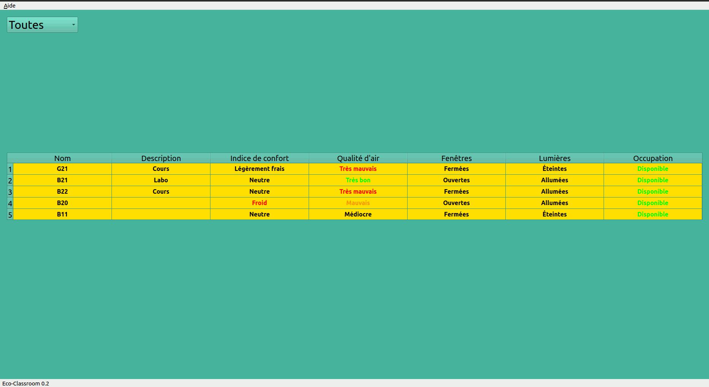
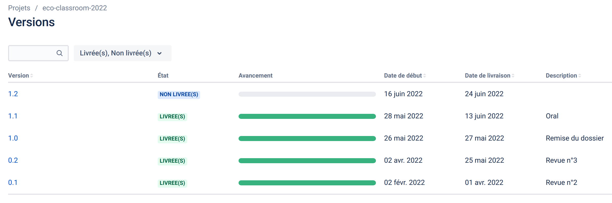
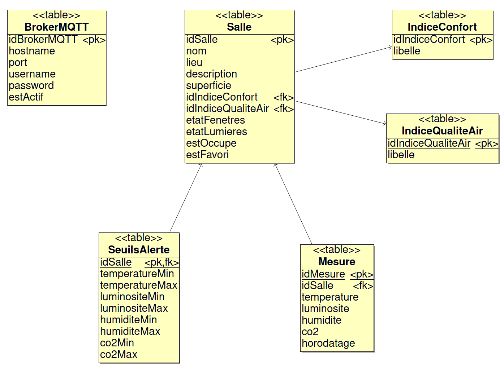

# Le projet eco-classroom-2022

- [Le projet eco-classroom-2022](#le-projet-eco-classroom-2022)
  - [Présentation](#présentation)
  - [Ressources logicielles](#ressources-logicielles)
  - [Historique des versions](#historique-des-versions)
  - [Diaporama](#diaporama)
  - [Auteur](#auteur)
  - [Kanban](#kanban)
  - [Documentation du code](#documentation-du-code)
  - [Base de données](#base-de-données)
  - [Qt MQTT](#qt-mqtt)
    - [Installation](#installation)
    - [Glossaire MQTT](#glossaire-mqtt)
    - [Structure des topics](#structure-des-topics)

## Présentation

Assurer une supervision de salles dans un établissement scolaire.

Chaque salle sera équipée de deux modules connectés afin de détecter et mesurer l’état de celle-ci :

- température, humidité, luminosité et qualité de l’air
- état ouverture/fermeture des fenêtres et l’état allumé/éteint des lumières

Les informations seront accessibles à partir d’une application PC permettant aux personnels d’assurer un suivi et d’intervenir en conséquence.

L'objectif est de superviser l’ensemble des salles afin d’intervenir directement dans les salles concernées (aérer ou fermer les fenêtres, éteindre les lumières).



## Ressources logicielles

| Désignation  | Caractéristiques |
| ------------ |:----------------:|
| Environnement de développement | Qt Creator |
| Bibliothèque logicielle | Qt 5.12.8, QtMqtt |
| Gestionnaire de versions | Git (Hébergement : Github) |
| Générateur de diagrammes UML | BOUML 7.11 |
| Planification | Beesbusy |
| Gestion de projet logiciel | Jira |
| OS du poste de développement | Ubuntu 20.04.1 |

## Historique des versions

- [Version 1.1](https://github.com/btssn-lasalle-84/eco-classroom-2022/releases/tag/1.1) : 11/06/2022
  - filtrage avec critères de la liste des salles
  - évaluation de l'indice de confort

- [Version 1.0](https://github.com/btssn-lasalle-84/eco-classroom-2022/releases/tag/1.0) : 27/05/2022
  - documentation du code

- [Version 0.2](https://github.com/btssn-lasalle-84/eco-classroom-2022/releases/tag/0.2) : 24/05/2022
  - mise à jour des données des salles en temps réel
  - édition et suppression d'une salle
  - ajout automatique d'une nouvelle salle
  - affichage de la liste des salles à partir de critères de filtrage 

- [Version 0.1](https://github.com/btssn-lasalle-84/eco-classroom-2022/releases/tag/0.1) : 03/04/2022
  - affichage de la liste des salles à partir de la base de données
  - affichage des informations d'une salle en la sélectionnant dans la liste
  - mise en oeuvre de la communication MQTT



## Diaporama

- [Revue finale ZERYOUHI Amine.pptx](docs/Revue%20finale%20ZERYOUHI%20Amine.pptx)

## Auteur

- Amine Zeryouhi <<aminzer2022@gmail.com>>

## Kanban

[eco-classroom-2022](https://github.com/btssn-lasalle-84/eco-classroom-2022/projects/1)

## Documentation du code

https://btssn-lasalle-84.github.io/eco-classroom-2022/

## Base de données

L'application Qt embarque une base de données SQLite `eco-classroom.db`.



Structure de la base de données :

```sql
-- Structure de la table IndiceConfort
-- indice : facultatif (peut être calculé à partir de l'id)

CREATE TABLE IF NOT EXISTS IndiceConfort(idIndiceConfort INTEGER PRIMARY KEY, indice INTEGER, libelle VARCHAR);

-- Structure de la table IndiceQualiteAir

CREATE TABLE IF NOT EXISTS IndiceQualiteAir(idIndiceQualiteAir INTEGER PRIMARY KEY, libelle VARCHAR);

-- Structure de la table Salle

CREATE TABLE IF NOT EXISTS Salle(
    idSalle INTEGER PRIMARY KEY AUTOINCREMENT,
    nom VARCHAR,
    lieu VARCHAR,
    description VARCHAR,
    superficie INTEGER DEFAULT 0,
    code VARCHAR(4),
    idIndiceConfort INTEGER DEFAULT -1,
    idIndiceQualiteAir INTEGER DEFAULT 0,
    etatFenetres INTEGER DEFAULT 0, -- Boolean values are stored as integers 0 (false) and 1 (true)
    etatLumieres INTEGER DEFAULT 0,
    estOccupe INTEGER DEFAULT 0,
    estFavori INTEGER DEFAULT 0,
    CONSTRAINT IndiceConfort_fk_1 FOREIGN KEY (idIndiceConfort) REFERENCES IndiceConfort(idIndiceConfort),
    CONSTRAINT IndiceQualiteAir_fk_1 FOREIGN KEY (idIndiceQualiteAir) REFERENCES IndiceQualiteAir(idIndiceQualiteAir)
);

-- Structure de la table Mesure

CREATE TABLE IF NOT EXISTS Mesure(
    idMesure INTEGER PRIMARY KEY AUTOINCREMENT,
    idSalle INTEGER NOT NULL,
    temperature DECIMAL(3,1), -- de -99.9 à 99.9
    luminosite SMALLINT UNSIGNED,
    humidite TINYINT UNSIGNED,
    co2 SMALLINT UNSIGNED,
    horodatage DATETIME NOT NULL,
    CONSTRAINT Salle_fk_1 FOREIGN KEY (idSalle) REFERENCES Salle(idSalle)
);

-- Structure de la table SeuilsAlerte

CREATE TABLE IF NOT EXISTS SeuilsAlerte(
    idSalle INTEGER NOT NULL,
    temperatureMin DOUBLE NULL,
    temperatureMax DOUBLE NULL,
    luminositeMin INTEGER NULL,
    luminositeMax INTEGER NULL,
    humiditeMin INTEGER NULL,
    humiditeMax INTEGER NULL,
    co2Min INTEGER NULL,
    co2Max INTEGER NULL,
    PRIMARY KEY (idSalle),
    CONSTRAINT Salle_fk_2 FOREIGN KEY (idSalle) REFERENCES Salle(idSalle)
);

-- Structure de la table BrokerMQTT
-- mqtt(s)://[username[:password]@]host[:port]/topic

CREATE TABLE IF NOT EXISTS BrokerMQTT(
    idBrokerMQTT INTEGER PRIMARY KEY AUTOINCREMENT,
    hostname VARCHAR NOT NULL,
    port INTEGER NOT NULL DEFAULT 1883,
    username VARCHAR DEFAULT NULL,
    `password` VARCHAR DEFAULT NULL,
    estActif INTEGER DEFAULT 1,
);
```

Initialisation de la base de données :

```sql
--- Table IndiceConfort

INSERT INTO IndiceConfort(idIndiceConfort,indice,libelle) VALUES
(-1,0,'inconnu'),
(0,-3,'froid'),
(1,-2,'frais'),
(2,-1,'légèrement frais'),
(3,0,'neutre'),
(4,1,'légèrement tiède'),
(5,2,'tiède'),
(6,3,'chaud');

--- Table IndiceQualiteAir

INSERT INTO IndiceQualiteAir(idIndiceQualiteAir,libelle) VALUES
(0,'inconnu'),
(1,'très bon'),
(2,'bon'),
(3,'moyen'),
(4,'médiocre'),
(5,'mauvais'),
(6,'très mauvais');
```

Quelques données de test :

```sql
--- Table Salle

INSERT INTO Salle(nom, lieu, description, superficie, code) VALUES ('B11','Bat. BTS','Cours','15','0000');
INSERT INTO Salle(nom, lieu, description, superficie, code) VALUES ('B20','Bat. BTS','Atelier','60','1234');
INSERT INTO Salle(nom, lieu, description, superficie, code) VALUES ('B21','Bat. BTS','Labo','40','1234');
INSERT INTO Salle(nom, lieu, description, superficie, code) VALUES ('B22','Bat. BTS','Cours','50','6666');

INSERT INTO BrokerMQTT(hostname,estActif) VALUES ('192.168.52.7',1);
```

## Qt MQTT

[Qt MQTT](https://doc.qt.io/QtMQTT/index.html) fournit une implémentation conforme à la norme MQTT.

Qt MQTT fait parti de [Qt For Automation](http://doc.qt.io/QtForAutomation/qtautomation-overview.html) et pas directement de Qt. Il faut donc l'installer.

### Installation

1. Identifier la version de Qt :

```sh
$ qmake -v
QMake version 3.1
Using Qt version 5.12.8 in /usr/lib/x86_64-linux-gnu
```

Ici, la version de Qt est `5.12.8`.

2. Récupérer le code source du module `mqtt` en clonant le dépôt git

```sh
$ sudo git clone https://code.qt.io/qt/qtmqtt.git
$ cd qtmqtt/
```

3. Sélectionner la branche qui correspond à la version de Qt utilisée

```sh
$ sudo git checkout 5.12.8
```

4. Installer le paquet fournissant les fichiers d'en-tête de développement indépendants

```sh
$ sudo apt install qtbase5-private-dev
```

5. Fabriquer et installer le module `mqtt`

```sh
$ sudo qmake

$ sudo make

$ sudo make install
```

Pour accèder aux classes du module Qt MQTT, il faudra ajouter le module `mqtt` au fichier de projet `.pro` :

```
QT += mqtt
```

### Glossaire MQTT

Les messages sont envoyés par des « _publishers_ » sur un « _topic_ » (canal de communication) à un « _broker_ » (serveur).

Ces messages peuvent être lus par des « _subscribers_ » (abonnés).

Les « _topics_ » peuvent avoir une hiérarchie qui permettra de sélectionner les informations.

Les « _publishers_ » et « _subscribers_ » sont considérés comme des « clients » MQTT. Le « _broker_ » est vu comme un serveur MQTT.

Dans le projet eco-classroom :

- les « publishers » sont les modules sonde et détection réparties dans les différentes salles
- les « subscribers » sont les applications de supervision (Mobile ou Desktop)

### Structure des topics

Racine de la hiérarchie des topics : `salles`

Les données des modules sonde et détection sont publiées sur le topic : `salles/nom/type`

- Le champ `nom` indique le nome de la salle, par exemple : `B20`, `B11`, ...
- Le champ `type` peut prendre les valeurs suivantes : `temperature|humidite|confort|luminosite|co2|air|fenetres|lumieres|occupation`

Exemple : La donnée `20.5` associé au topic `salles/B20/temperature` sera une température en Celsius.

Les topics pour une salle, ici **B20** :

```
salles/B20/temperature
salles/B20/humidite
salles/B20/confort
salles/B20/luminosite
salles/B20/co2
salles/B20/air
salles/B20/fenetres
salles/B20/lumieres
salles/B20/occupation
```

Deux « _wild-cards_ » (jokers) sont utilisables dans les topics : `+` et `#` :

- `+` : sujet unique. Par exemple : `salles/+/temperature` sera abonné pour recevoir la température de toutes les salles (`salles/B20/temperature`, `salles/B11/temperature`, ...
- `#` : multi-sujets. Par exemple : `salles/#` sera abonné à toutes les données de toutes les salles (`salles/B20`, `salles/B11`, ...)

©️ LaSalle Avignon 2022
