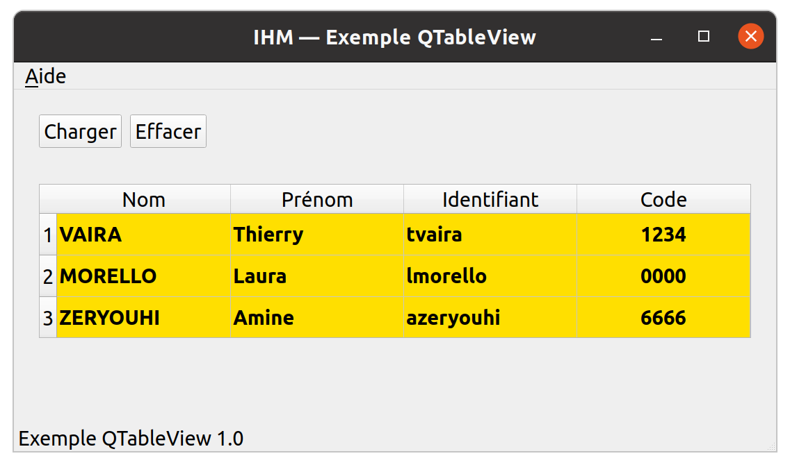
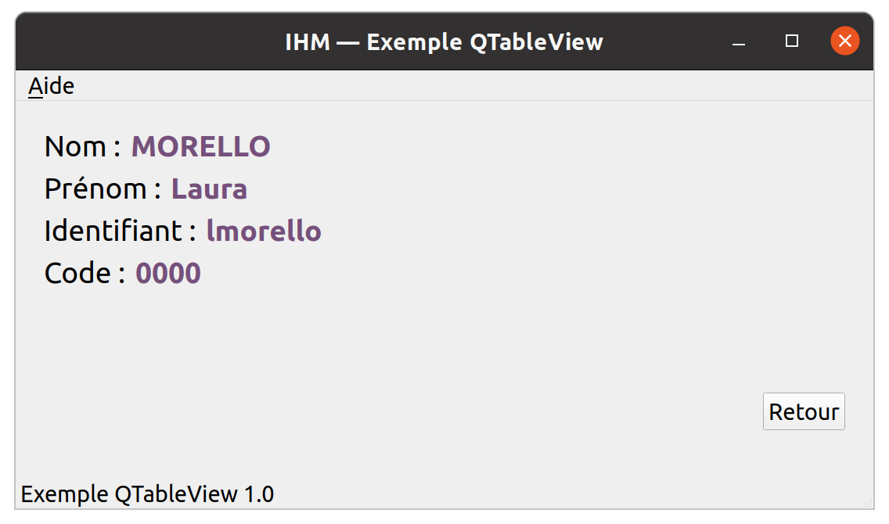
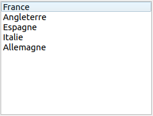
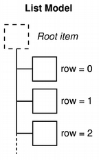
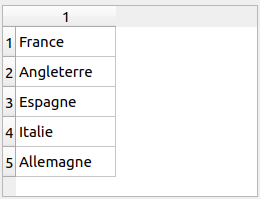
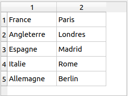
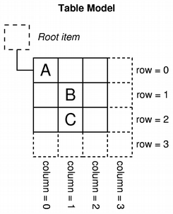
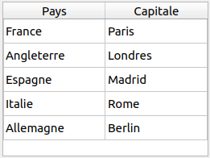

# Exemple d'utilisation d'un QTableView





> L'exemple fourni utilise une base de données SQLite. Voir : http://tvaira.free.fr/projets/activites/activite-base-donnees.html

## Architecture Model/View sous Qt

Liens :

- http://tvaira.free.fr/dev/qt/faq-qt.html#laffichage-de-donn%C3%A9es-sous-forme-de-tableau-table
- http://tvaira.free.fr/dev/qt/qt-modelview.pdf

### Introduction

Qt utilise une architecture Modèle / Vue (_Model/View_) afin de gérer la relation entre les données et la façon dont elles sont présentées à l'utilisateur.

Les deux notions de base sont :

- le **modèle** qui contient les données ;
- la **vue** qui est la représentation graphique des données du modèle.

Qt utilise en réalité une architecture Modèle / Vue (_Model/View_) entourée d'un **délégué** (_delegate_). La gestion des interactions avec l'utilisateur est réalisée par la vue en utilisant par un composant « interne » à celle-ci : le délégué.

Le délégué sera responsable de personnaliser :

- l'édition des éléments au moyen d'un éditeur ;
- le rendu des éléments à l'intérieur d'une vue.


Tous les modèles fournis par Qt sont basés sur la classe `QAbstractItemModel`. De base, Qt fournit un ensemble de modèles pouvant être directement utilisés comme par exemple `QStringListModel` qui stocke une liste de `QString`.

Mais vous pouvez aussi créer votre propre modèle en héritant d'une des classes suivantes par exemple :

- `QAbstractListModel` : pour un modèle de type liste (associé à une `QListView`) ;
- `QAbstractTableModel` : pour un modèle de type tableau (associé à une `QTableView`).

Ensuite, Qt fournit des types de vue comme par exemple :

- `QListView` : liste d'éléments ;
- `QTableView` : tableau d'éléments ;

Les vues sont déjà dotées d'un délégué par défaut de type `QStyledItemDelegate`.

### Principe de base

#### QListView

```cpp
// Des données (simplement pour initialiser le modèle)
QStringList listePays;
listePays << "France" << "Angleterre" << "Espagne" << "Italie" << "Allemagne";

// Un modèle initialisé avec des données
QStringListModel *modele = new QStringListModel(listePays);

// Une vue (un widget)
QListView *vueListe = new QListView;

// Association de la vue et du modèle
vueListe->setModel(modele);
```



Pour accéder aux données du modèle, il faut un utiliser la notion d'index de modèle : `QModelIndex`. L’index permet d’accéder à un objet contenu dans le modèle. Dans un modèle Liste, on aura une notion de ligne :

Par défaut, les éléments d’une vue sont “éditables”. Pour les rendre non “éditables”, il faudra faire : `vueListe->setEditTriggers(QAbstractItemView::NoEditTriggers)`;



Si on veut ajouter une donnée, il faut simplement l'ajouter au modèle de la manière suivante :

```cpp
// Ajout d'une nouvelle ligne
int numeroLigne = modele->rowCount();
modele->insertRow(numeroLigne);
// Ajout de la donnée pour cette nouvelle ligne
QModelIndex index = modele->index(numeroLigne); // l'index de cette ligne
modele->setData(index, QString("Belgique"));
```

Si on veut supprimer la dernière donnée, on fera :

```cpp
// Récupération du nombre de lignes
int nbLignes = modele->rowCount();
if(nbLignes > 0)
{
    // Suppression d'une ligne : la dernière
    modele->removeRows(nbLignes-1, 1);
}
```

Si on veut récupérer une donnée par un simple clic sur la vue de la liste : `connect(vueListe, SIGNAL(clicked(QModelIndex)), this, SLOT(selectionner(QModelIndex)));`

Et dans le slot `void selectionner(QModelIndex index)` : `qDebug() << index.data().toString();`


#### QTableView

Si on reprend le même modèle avec une vue Table, on obtient :

```cpp
// Une vue Table (un widget)
vueTable = new QTableView(this);
// Association de la vue Table et du modèle
vueTable->setModel(modele);
```



On va maintenant utiliser un autre modèle pour la vue Table :

```cpp
// Des données
QStringList listePays;
listePays << "France" << "Angleterre" << "Espagne" << "Italie" << "Allemagne";
QStringList capitalesPays;
capitalesPays << "Paris" << "Londres" << "Madrid" << "Rome" << "Berlin";

// Un autre modèle initialisé avec des données
autreModele = new QStandardItemModel(listePays.size(), 2);
for (int ligne = 0; ligne < listePays.size(); ligne++)
{
     QStandardItem *item = new QStandardItem(listePays.at(ligne));
     autreModele->setItem(ligne, 0, item);
}
for (int ligne = 0; ligne < capitalesPays.size(); ligne++)
{
     QStandardItem *item = new QStandardItem(capitalesPays.at(ligne));
     autreModele->setItem(ligne, 1, item);
}

// Une vue Table (un widget)
vueTable = new QTableView(this);

// Association de la vue Table et du modèle
vueTable->setModel(autreModele);

// Les éléments de la vue Table ne seront pas "éditables"
vueTable->setEditTriggers(QAbstractItemView::NoEditTriggers);
```

On obtient :



Pour accéder aux données de ce modèle, on utilisera aussi la notion d'index de modèle : `QModelIndex`. L’index permet d’accéder à un objet contenu dans le modèle. Dans un modèle Table, on aura une notion de ligne et de colonne :



Si on veut récupérer une donnée par un simple clic sur la vue de la table : `connect(vueTable, SIGNAL(clicked(QModelIndex)), this, SLOT(selectionner(QModelIndex)));`


Et dans le slot `void selectionner(QModelIndex index)` : `qDebug() << index.data().toString();`


On peut personnaliser l’affichage de la vue Table :

```cpp
// Masquer les numéros de ligne
vueTable->verticalHeader()->setHidden(true);
// Redimensionner automatiquement la colonne pour occuper l'espace disponible
vueTable->horizontalHeader()->setSectionResizeMode(QHeaderView::Stretch); // voir aussi QHeaderView::ResizeToContents
```

Et on peut ajouter un en-tête aux colonnes :

```cpp
QStringList nomColonnes; // nom des colonnes
nomColonnes << "Pays" << "Capitale";
autreModele->setHorizontalHeaderLabels(nomColonnes);
```



